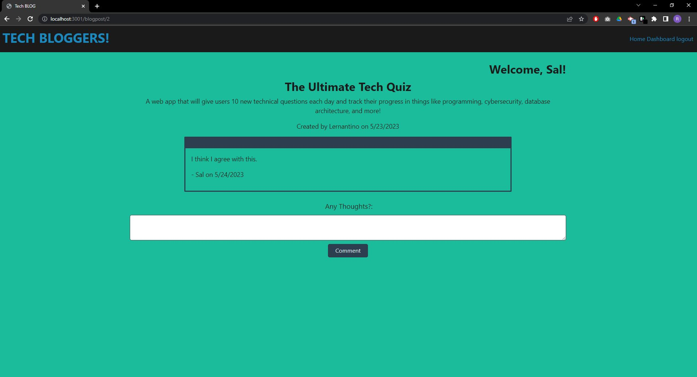

#                             TechBloggers

  

##  Table of Contents  

1. [Description](#desc)
2. [Installation](#install)
3. [Usage](#usage)
4. [License](#license) 
5. [Contributions](#contributions)
6. [Testing](#testing)
7. [Questions](#questions) 

## 1. Descrption

At homepage, able to see all blogposts created by other users. To be able to make your own blogs as well as comment on other users blogs, simply sign up through the sign up link and you'll be given special access with your own user dashboard.  

## Insallation
No installation required. 

## 3. Usage Information

N/a

## License   

 

## Contributions 

N/a

## Tests

N/a

## Questions 

Feel free to browse my github profile here @ https://github.com/rxs291
If you have any questions, reach me at my email here, rxs291@yahoo.com.

